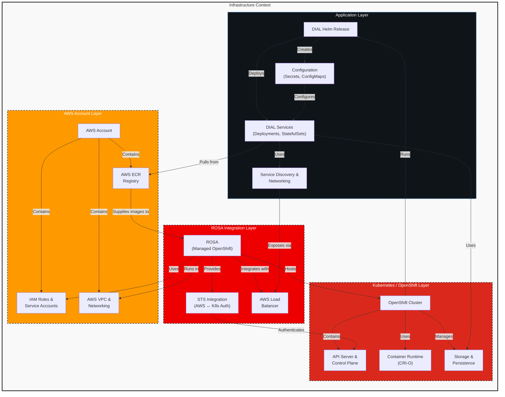

```mermaid
graph TB
    subgraph CONTEXT["Infrastructure Context"]
        direction TB

        subgraph AWS_LAYER["AWS Account Layer"]
            AWS_ACCOUNT["AWS Account"]
            IAM_ROLES["IAM Roles &<br/>Service Accounts"]
            AWS_NETWORK["AWS VPC &<br/>Networking"]
            AWS_REGISTRY["AWS ECR<br/>Registry"]
        end

        subgraph ROSA_LAYER["ROSA Integration Layer"]
            ROSA["ROSA<br/>(Managed OpenShift)"]
            STS["STS Integration<br/>(AWS ↔ K8s Auth)"]
            LOAD_BALANCER["AWS Load<br/>Balancer"]
        end

        subgraph K8S_LAYER["Kubernetes / OpenShift Layer"]
            K8S_CLUSTER["OpenShift Cluster"]
            API_SERVER["API Server &<br/>Control Plane"]
            RUNTIME["Container Runtime<br/>(CRI-O)"]
            STORAGE["Storage &<br/>Persistence"]
        end

        subgraph APP_LAYER["Application Layer"]
            HELM_RELEASE["DIAL Helm Release"]
            DIAL_SERVICES["DIAL Services<br/>(Deployments, StatefulSets)"]
            CONFIG["Configuration<br/>(Secrets, ConfigMaps)"]
            NETWORKING["Service Discovery &<br/>Networking"]
        end
    end

    %% AWS Layer connections
    AWS_ACCOUNT -->|Contains| IAM_ROLES
    AWS_ACCOUNT -->|Contains| AWS_NETWORK
    AWS_ACCOUNT -->|Contains| AWS_REGISTRY

    %% ROSA Layer connections
    ROSA -->|Uses| IAM_ROLES
    ROSA -->|Runs in| AWS_NETWORK
    ROSA -->|Provides| STS
    ROSA -->|Integrates with| LOAD_BALANCER
    AWS_REGISTRY -->|Supplies images to| ROSA

    %% K8S Layer connections
    ROSA -->|Hosts| K8S_CLUSTER
    K8S_CLUSTER -->|Contains| API_SERVER
    K8S_CLUSTER -->|Uses| RUNTIME
    K8S_CLUSTER -->|Manages| STORAGE
    STS -->|Authenticates| API_SERVER

    %% App Layer connections
    K8S_CLUSTER -->|Runs| HELM_RELEASE
    HELM_RELEASE -->|Deploys| DIAL_SERVICES
    HELM_RELEASE -->|Creates| CONFIG
    DIAL_SERVICES -->|Uses| NETWORKING
    DIAL_SERVICES -->|Pulls from| AWS_REGISTRY
    CONFIG -->|Configures| DIAL_SERVICES
    DIAL_SERVICES -->|Uses| STORAGE
    NETWORKING -->|Exposes via| LOAD_BALANCER

    %% Layer styling
    classDef awsLayer fill:#FF9900,stroke:#232F3E,color:#fff,stroke-width:2px,stroke-dasharray: 5 5
    classDef rosaLayer fill:#EE0000,stroke:#231F20,color:#fff,stroke-width:2px,stroke-dasharray: 5 5
    classDef k8sLayer fill:#DA291C,stroke:#231F20,color:#fff,stroke-width:2px,stroke-dasharray: 5 5
    classDef appLayer fill:#0F1419,stroke:#1f77c0,color:#fff,stroke-width:2px,stroke-dasharray: 5 5
    classDef contextStyle fill:#f9f9f9,stroke:#333,color:#333,stroke-width:3px

    class CONTEXT contextStyle
    class AWS_LAYER awsLayer
    class ROSA_LAYER rosaLayer
    class K8S_LAYER k8sLayer
    class APP_LAYER appLayer
```